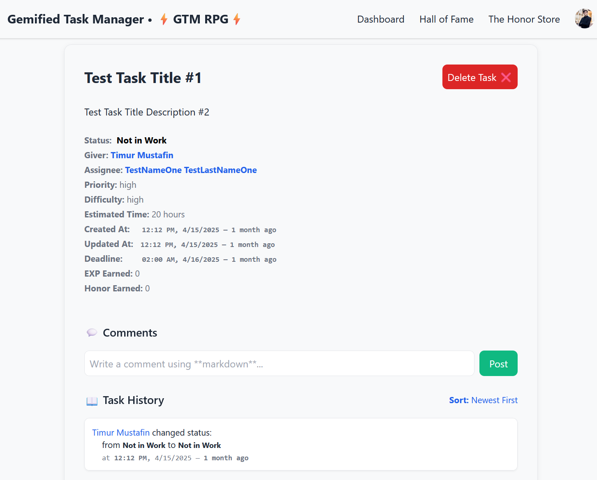

# Gamified Task Manager

A full-stack web app to manage tasks with gamification mechanics.

---
## Tech Stack

**Backend**  
- Django 4.x, Django REST Framework
- JWT auth (`djangorestframework-simplejwt`)
- PostgreSQL
- Swagger/OpenAPI (drf-yasg)

**Frontend**  
- React 18 + Vite
- TailwindCSS
- lucide-react
- date-fns, timeago.js, marked  

**Dev Tools**  
- Docker + Docker Compose  
- Pytest / Django test framework  
- VSCode with multi-terminal setup

---

## Features

- **User Roles**: Giver, Assignee, Admin  
- **Task Management**: Title, Description, Deadline, Status  
- **Task History**:  
  - Status updates  
  - User comments  
  - System events (file upload, deletion)  
  - Filterable & sortable  
- **Attachments**: Upload/delete with logging  
- **Gamification System**: XP for completed tasks *(store/dashboard coming soon)*  
- **Timestamps**: Humanized + exact (e.g., `12:30 PM, 22/04/2025 — 2 hours ago`)  
- **JWT-based authentication** with manual admin promotion

---

## Preview





---

## Project Structure

```plaintext
gamified_task_manager/
│
├── docs/
│   ├── dashboard_view.png
│   ├── task_history_view.png
│   └── hall_of_fame.png
│
├── backend/
│   ├── core/settings/          # base.py / dev.py / prod.py
│   ├── tasks/                  # models/, views/, serializers/, utils/
│   ├── manage.py
│   └── requirements.txt
│
├── frontend/
│   ├── src/                    # React components
│   ├── tailwind.config.js
│   └── vite.config.js
│
├── docker-compose.yml
└── README.md
```

---

## Getting Started

### Prerequisites
- Python 3.11+
- Node.js 18+
- Docker + Docker Compose

---

### Database with Docker

```bash
docker compose up -d db
```

---

### Backend Setup

```bash
# From project root:
cd backend
python -m venv venv
venv\Scripts\activate      # or source venv/bin/activate on Linux/macOS
pip install -r requirements.txt

# Apply migrations
python manage.py makemigrations --settings=core.settings.dev
python manage.py migrate --settings=core.settings.dev

# Create superuser
python manage.py createsuperuser --settings=core.settings.dev
```

> 💡 Manually promote superuser to admin:
```python
# in shell
python manage.py shell --settings=core.settings.dev
from django.contrib.auth import get_user_model
User = get_user_model()
u = User.objects.get(username='admin')
u.role = 'admin'
u.save()
```

```python
# Run Django backend
python manage.py runserver --settings=core.settings.dev
```
---

### Frontend Setup

```bash
cd frontend
npm install
npm install -D tailwindcss postcss autoprefixer
npm install lucide-react date-fns timeago.js marked
npm run dev
```

---

## Version

Current: `v0.5.2`

---

## License

[MIT License](LICENSE)

---

## Roadmap

- Store module (XP → rewards) #Done
- Dashboard (progress graphs, ranking) #Done

- **Auction-based Task Assignment** *(in progress)*  

  Givers will be able to:
  - Assign tasks to multiple candidates
  - Receive time/quality estimates from each
  - Choose based on best offer (ETA + quality)

- Notifications/reminders (planned)
- AI-powered suggestions (planned)
- Customized CSS with presets over tailwind CSS (planned)

---

## Contributing

Coming soon — PR template, issue guidelines, and contribution docs.

---

## 🌐 Author

**Timur Mustafin**  
[github.com/timur-mustafin](https://github.com/timur-mustafin)

